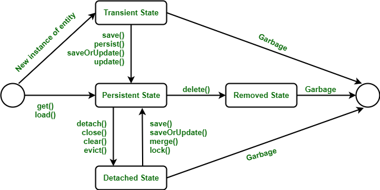

영속성 컨텍스트와 Entity Manger는 **JPA의 핵심**이라고 해도 과언이 아니다.

## JPA 흐름
---
5가지 정도를 소개하려고 한다.
1. **Persistence Unit** : DB 연결을 설정
2. **Entity** : DB와 매핑되는 객체
3. **Entity Manger Factory** : Entity Manager를 생성
4. **Entity Manager** : Entity를 관리
5. **Persistence Context** (영속성 컨텍스트) : Entity를 관리하는 공간

## Entity Manager Factory
---
Entity Manger Factory는 이름과 같이 **Entity Manger를 생성하는 역할**을 한다.
이때, **Persistence Unit의 설정에 맞게 생성**한다.

Entity Manger factory의 특징
- 하나의 데이터베이스에 하나만 생성한다. (비용이 비싸다)
- 여러 스레가 동시에 접근해도 안전하다.

## Entity Manager
---
영속성 컨텍스트를 관리하는 역할을 한다.

자세히 어떤 역할을 하는지는 아래의 영속성 컨텍스트를  보며 이해해보자.

## 영속성 컨텍스트
---
영속성 컨텍스트에 대해서 아래와 같이 많이 설명한다.

>영속성 컨텍스트란 "엔티티를 영구 저장하는 환경"이라는 뜻이다.

간단히 말하면, "메모리에서 효율적으로 엔티티를 관리하는 공간" 이다.

이 공간에서 Entity Manger가 엔티티를 관리하게 된다.
마치 영속성 컨텍스트가 주방이고 Entity Manger가 주방장인 셈이다.

### 영속성 컨텍스트의 기능
---
Hibernate는 영속성 컨텍스트를 아래와 같이 활용한다.
1. **1차 캐시**
2. **쓰기 지연(Write-behind)**
3. **변경 감지(dirty checking)**

#### 1차 캐시
엔티티와 그에 대한 id를 Map 형태로 저장하는 캐시이다.
캐시는 DB에 접근하는 것에 비해 높은 속도를 낼 수 있도록 해주는 개념이다.

1차 캐시에 엔티티가 있으면 DB접근 없이 연산을 수행할 수 있다.

```java
void test(){
	Point p = new Point("여기");

	entityManger.persist(p); //영속화

	entityManager.find(Point.class, p.getId());  //조회1
	entityManager.find(Point.class, p.getId());  //조회2
}
```

우선 영속화란 엔티티 인스턴스가 영속성 컨텍스트에 저장되는 것이다.

위의 코드를 돌려보면 DB를 조회하는 **쿼리문이 한번**만 나간다.
이는 **1차 캐시 덕분**이다.

그 과정은 아래와 같다.
1. 영속화를 시킬때 DB에서 조회를 해서 엔티티 인스턴스를 가져온다.
2. 이를 1차 캐시에 저장한다.
3. 다시 조회가 들어오면 해당 1차 캐시에 저장된 엔티티 인스턴스를 가져온다.

1차 캐시에 저장된(메모리에 저장된) 엔티티 인스턴스를 가져왔기 때문에 쿼리문이 나가지 않은 것이다.

#### 쓰기 지연(Write-behind)
엔티티에 대한 작업이 이루어질 때, **바로 DB에 적용하지 않는 것**을 이야기한다.
즉, 1차 캐시에만 반영하고 쿼리는 **쓰기 지연 저장소에 쌓아둔다.**

이렇게 쌓아둔 쿼리는 동기화(flush) 할때 한꺼번에 보낸다.

```java
void test(){
	Point p1 = new Point("여기");
	Point p2 = new Point("저기");

	entityManger.persist(p1); //영속화
	entityManger.persist(p2);

	p1.setName("거기");
	System.out.println("p1을 옮겼음");
	p2.setName("이쯤");
	System.out.println("p2를 옮겼음");
}
```

위 코드의 경우 흐름이 아래와 같다.
1. p1, p2를 조회하기 위한 쿼리가 두번 나간다.
2. "p1을 옮겼음" 출력
3. "p2를 옮겼음" 출력
4. p1, p2를 변경하기 위한 쿼리가 두번 나간다.

분명 출력문을 변경 쿼리 사이에 끼웠는데 마지막에 쿼리가 한꺼번에 나간다.
이는, 쓰기 지연 저장소에 쿼리를 저장해뒀다가 **flush할 때 한번에 보내기 때문**이다.
(물론 entityManger.flush()를 사용하면 중간에 쿼리를 날릴 수 있다.)

#### 변경 감지(dirty checking)
자동으로 변경을 감지해주는 것을 말한다.

JPA는 엔티티가 영속성 컨텍스트에 처음 들어올 때 그 상태를 복사해 저장한다. (스냅샷)

flush를 하기 전, 스냅샷과 현재 상태를 비교해서 UPDATE 쿼리를 쓰기 지연 저장소에 추가한다.

```java
void test(){
	Point p1 = new Point("여기");
	Point p2 = new Point("저기");

	entityManger.persist(p1); //영속화
	entityManger.persist(p2);

	p1.setName("거기");
	System.out.println("p1을 옮겼음");
	p2.setName("이쯤");
	System.out.println("p2를 옮겼음");
}
```

사실 쓰기 지연을 볼 때, 이상함을 느꼈어야한다.
우리는 p1, p2에 대한 변경을 했는데 왜 DB에 적용되지?

그 이유는 **JPA가 변경점을 체크**해줬기 때문이다.

영속화를 시킬 때, 1차 캐시에 **p1과 p2의 스냅샷이 저장**된다.
이후 우리가 p1과 p2를 수정하고 flush를 할 때, 스냅샷과 변경된 엔티티를 비교한다.
만약 달라진 점이 있다면, JPA는 쓰기 지연 저장소에 UPDATE 쿼리를 저장하게 된다.

따라서, 우리는 엔티티 수정만 했는데 DB에 적용이 된 것이다.

## Entity Status
---
엔티티는 4가지 상태를 가진다.
1. 비영속
2. 영속
3. 준영속
4. 삭제

#### 비영속
객체가 생성되었지만 **영속성 컨텍스트에 관리 되지 않는 상태**이다.
즉, 순수 자바 객체의 상태를 이야기한다.

#### 영속
엔티티가 **영속성 컨텍스트에 저장**되어 **엔티티 매니저의 관리**를 받는 상태이다.
1차캐시, 쓰기 지연, 변경 감지의 대상이 된다.

#### 준영속
영속상태 였으나 **영속성 컨텍스트에서 분리**된 상태이다.
영속성 컨텍스트가 닫히면 그 안에 있던 엔티티(영속 객체)는 준영속 상태가 된다.

#### 삭제
영속성 컨텍스트에서 관리되고 있으나 **삭제하기로 표시된 상태**이다.
flush할 때, DELETE 쿼리가 쓰기 지연 저장소에 들어간다.

그냥 삭제하면 되는건데 왜 삭제상태가 필요할까라는 의문이 들 수 있다.
아래의 상황을 가정해보면 된다.
1. 영속 객체를 삭제하기로 했다.
2. 그 객체를 조회했다.

만약 실제 DB와 연결이 되어있었다면 **2번과정은 불가능해야한다**.
하지만, 영속성 컨텍스트와 연결되어있기 때문에 **인스턴스에 대한 조회가 불가능 하다는 것을 알려줘야한다**.


아래의 이미지는 Entity Manger가 관리하는 Entity의 생명 주기이다.



Entity Manager는 이렇게 **Entity의 상태를 바꾸어주는 역할**을 한다.